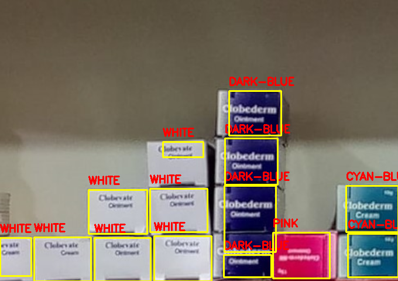

# Color Detection and Tracking

This repository presents Python scripts designed for color detection and tracking in images using OpenCV. It comprises two main scripts:

- `track.py`: This script tracks a specific color range in a live camera feed.
- `test.py`: It detects and counts colors in an image using the HSV color space.

## Installation
To get started, clone this repository using the `git clone` command.

## Usage

### Tracking Color in Live Camera Feed (`track.py`)
Run the `track.py` script to set up the color ranges for specific colors based on your selected image and the color you wish to detect.

### Testing Color in Live Environment / Images (`test.py`)
Upload the image you want to test for the presence of colors you have specified for detection.

## Results
After testing the image, upon exiting the Python window, you will see the quantities of the specific color you chose displayed on the terminal.

### Result for this image : 
Quantity of CYAN-BLUE: 2
Quantity of DARK-BLUE: 4
Quantity of RED: 0      
Quantity of YELLOW: 0   
Quantity of WHITE: 7    
Quantity of PINK: 1 

